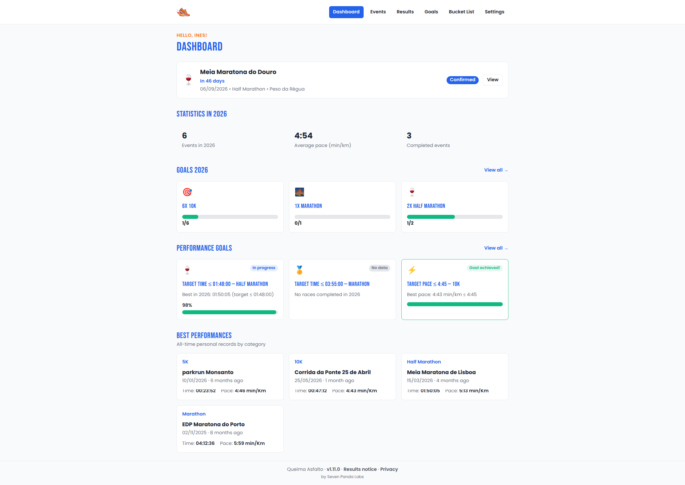
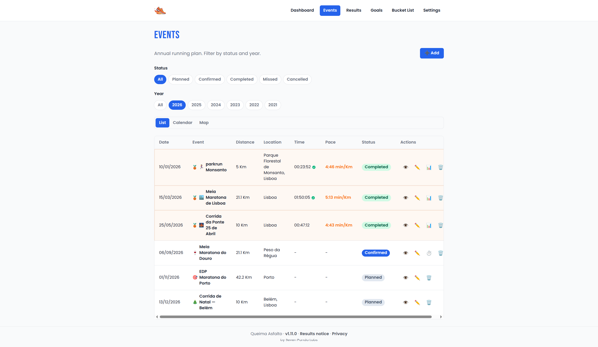
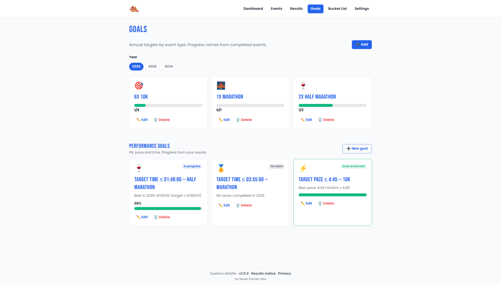
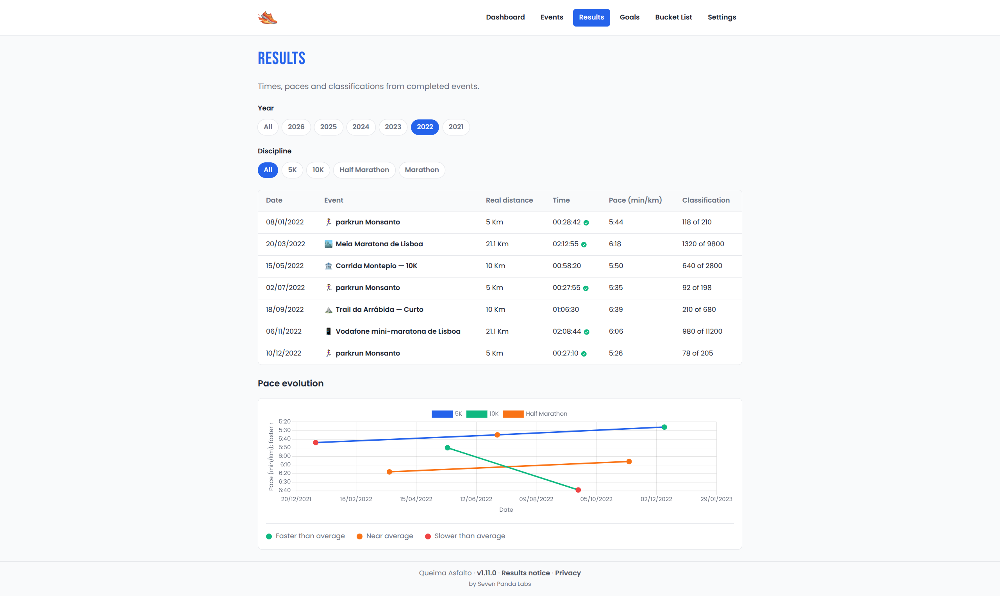

<p align="center">
  
</p>

<p align="center">
  <a href="https://github.com/Seven-Panda-Labs/queima-asfalto/actions/workflows/ci.yml"></a>
  <a href="https://github.com/Seven-Panda-Labs/queima-asfalto/blob/main/package.json"></a>
  <a href="LICENSE"></a>
</p>

# Queima Asfalto

**Português** · [English](#english)

---

<a id="portugues"></a>

## Português

PWA para planear e acompanhar uma época de corrida: eventos, objetivos, resultados, ritmo e metas de performance. Funciona offline e sincroniza via Firebase.

<p align="center">
  
  
  <br />
  
  
</p>
<p align="center"><sub>Capturas da instância em <a href="https://queima-asfalto.web.app">queima-asfalto.web.app</a></sub></p>

### Funcionalidades

- Calendário de eventos com estados, localização e mapa
- Objetivos anuais e metas de performance
- Registo de resultados com importação de classificações oficiais (vários conectores de timing)
- Partilha de eventos, objetivos e resultados entre utilizadores
- PWA instalável com suporte offline (Firestore persistence)
- Modo claro / escuro; interface em português (pt-PT) e inglês (en-GB)

### Stack

React 19 · TypeScript · Vite · Tailwind CSS · Firebase (Auth, Firestore, Storage, Cloud Functions) · Leaflet · Chart.js

### Desenvolvimento local

**Requisitos:** Node.js 24 (Java 21+ se usares emuladores Firebase)

**Sem projeto Firebase na cloud** — emuladores locais (recomendado para contribuir):

```bash
git clone https://github.com/Seven-Panda-Labs/queima-asfalto.git
cd queima-asfalto
npm install
npm --prefix functions install
cp .env.emulator.example .env.local
npm run emulators    # terminal 1
npm run dev          # terminal 2
```

Guia completo: [`docs/emulators.md`](docs/emulators.md) (login «Entrar (emulador)», limitações, modo híbrido).

**Com projeto Firebase teu** (Google Sign-In, deploy):

```bash
git clone https://github.com/Seven-Panda-Labs/queima-asfalto.git
cd queima-asfalto
npm install
cp .env.example .env.local
cp .firebaserc.example .firebaserc   # edita com o teu project ID
# opcional, para deploy de Functions com service account dedicada:
cp functions/.env.example functions/.env
npm run dev
```

Preenche `.env.local` com as credenciais do teu projeto Firebase. Variáveis completas em [`docs/configuration.md`](docs/configuration.md).

| Variável | Uso |
|----------|-----|
| `VITE_FIREBASE_*` | Configuração da Web App Firebase |
| `VITE_FIREBASE_VAPID_KEY` | Notificações push (opcional em dev) |
| `VITE_GEOAPIFY_API_KEY` | Autocomplete e geocodificação de locais |

Abre [http://localhost:5173](http://localhost:5173). Adiciona `localhost` aos domínios autorizados em Firebase Authentication.

Deploy completo (Firebase, Auth, Functions, FCM, Geoapify): [`docs/self-hosting.md`](docs/self-hosting.md).

### Scripts

| Comando | Descrição |
|---------|-----------|
| `npm run dev` | Servidor de desenvolvimento |
| `npm run emulators` | Firebase Emulator Suite (Auth, Firestore, Functions, Storage) |
| `npm run build` | Build de produção |
| `npm run test` | Testes (Vitest) |
| `npm run check` | Lint + testes + verificação do changelog |
| `npm run setup:githooks` | Activa o pre-commit hook (uma vez por clone) |

Alterações de versão devem actualizar `package.json`, `change-log.md` e `change-log.en.md`.

### Documentação

| Ficheiro | Conteúdo |
|----------|----------|
| [`AGENTS.md`](AGENTS.md) | Instruções para agentes de IA (branches, PRs, CI) |
| [`CONTRIBUTING.md`](CONTRIBUTING.md) | Como contribuir (setup, testes, changelog, PRs) |
| [`CODE_OF_CONDUCT.md`](CODE_OF_CONDUCT.md) | Código de conduta da comunidade (Contributor Covenant 2.1) |
| [`SECURITY.md`](SECURITY.md) | Reportar vulnerabilidades |
| [`docs/self-hosting.md`](docs/self-hosting.md) | Guia passo-a-passo de deploy (Firebase, FCM, Geoapify) |
| [`docs/configuration.md`](docs/configuration.md) | Variáveis de ambiente e configuração de infra |
| [`docs/emulators.md`](docs/emulators.md) | Desenvolvimento local com emuladores (sem projeto cloud) |
| [`docs/privacy-policy-template.md`](docs/privacy-policy-template.md) | Modelo de política de privacidade (self-hosters, RGPD) |
| [`docs/timing-scraping-disclaimer.md`](docs/timing-scraping-disclaimer.md) | Aviso sobre scraping de sites de timing e ToS de terceiros |
| [`docs/architecture.md`](docs/architecture.md) | Arquitectura (PWA, Firestore, Cloud Functions, conectores) |
| [`docs/adding-a-results-connector.md`](docs/adding-a-results-connector.md) | Guia para adicionar um conector de resultados oficiais |
| [`docs/console-restrictions.md`](docs/console-restrictions.md) | Restrições Firebase / Geoapify no Console |
| [`docs/visual-identity.md`](docs/visual-identity.md) | Paleta, tipografia e tokens de UI |
| [`docs/voice.md`](docs/voice.md) | Tom de voz da marca (copy e i18n) |

Histórico de versões: [`change-log.md`](change-log.md) · [`change-log.en.md`](change-log.en.md)

### Licença

[GNU Affero General Public License v3.0](LICENSE) (AGPL-3.0).

### Contribuir

Issues e pull requests são bem-vindos. Lê [`CONTRIBUTING.md`](CONTRIBUTING.md) (setup, `npm run check`, changelog, estilo de PR). Agentes de IA: [`AGENTS.md`](AGENTS.md).

---

<a id="english"></a>

## English

[Português](#portugues)

PWA to plan and track a running season: events, goals, results, pacing, and performance targets. Works offline and syncs via Firebase.

### Features

- Event calendar with statuses, location, and map
- Annual goals and performance targets
- Results logging with official race import (multiple timing connectors)
- Sharing events, goals, and results between users
- Installable PWA with offline support (Firestore persistence)
- Light / dark mode; UI in Portuguese (pt-PT) and English (en-GB)

### Stack

React 19 · TypeScript · Vite · Tailwind CSS · Firebase (Auth, Firestore, Storage, Cloud Functions) · Leaflet · Chart.js

### Local development

**Requirements:** Node.js 24 (Java 21+ if using Firebase emulators)

**No cloud Firebase project** — local emulators (recommended for contributors):

```bash
git clone https://github.com/Seven-Panda-Labs/queima-asfalto.git
cd queima-asfalto
npm install
npm --prefix functions install
cp .env.emulator.example .env.local
npm run emulators    # terminal 1
npm run dev          # terminal 2
```

Full guide: [`docs/emulators.md`](docs/emulators.md) (“Sign in (emulator)”, limitations, hybrid mode).

**With your own Firebase project** (Google Sign-In, deploy):

```bash
git clone https://github.com/Seven-Panda-Labs/queima-asfalto.git
cd queima-asfalto
npm install
cp .env.example .env.local
cp .firebaserc.example .firebaserc   # edit with your project ID
# optional, for Functions deploy with a dedicated service account:
cp functions/.env.example functions/.env
npm run dev
```

Fill in `.env.local` with your Firebase credentials. Full variable reference in [`docs/configuration.md`](docs/configuration.md).

| Variable | Purpose |
|----------|---------|
| `VITE_FIREBASE_*` | Firebase Web App configuration |
| `VITE_FIREBASE_VAPID_KEY` | Push notifications (optional in dev) |
| `VITE_GEOAPIFY_API_KEY` | Location autocomplete and geocoding |

Open [http://localhost:5173](http://localhost:5173). Add `localhost` to authorized domains in Firebase Authentication.

Full deploy guide (Firebase, Auth, Functions, FCM, Geoapify): [`docs/self-hosting.md`](docs/self-hosting.md).

### Scripts

| Command | Description |
|---------|-------------|
| `npm run dev` | Development server |
| `npm run emulators` | Firebase Emulator Suite (Auth, Firestore, Functions, Storage) |
| `npm run build` | Production build |
| `npm run test` | Tests (Vitest) |
| `npm run check` | Lint + tests + changelog verification |
| `npm run setup:githooks` | Enable pre-commit hook (once per clone) |

Version bumps must update `package.json`, `change-log.md`, and `change-log.en.md`.

### Documentation

| File | Contents |
|------|----------|
| [`AGENTS.md`](AGENTS.md) | Instructions for AI agents (branches, PRs, CI) |
| [`CONTRIBUTING.md`](CONTRIBUTING.md) | How to contribute (setup, tests, changelog, PRs) |
| [`CODE_OF_CONDUCT.md`](CODE_OF_CONDUCT.md) | Community code of conduct (Contributor Covenant 2.1) |
| [`SECURITY.md`](SECURITY.md) | Report security vulnerabilities |
| [`docs/self-hosting.md`](docs/self-hosting.md) | Step-by-step deploy guide (Firebase, FCM, Geoapify) |
| [`docs/configuration.md`](docs/configuration.md) | Environment variables and infrastructure setup |
| [`docs/emulators.md`](docs/emulators.md) | Local development with emulators (no cloud project) |
| [`docs/privacy-policy-template.md`](docs/privacy-policy-template.md) | Privacy policy template (self-hosters, GDPR) |
| [`docs/timing-scraping-disclaimer.md`](docs/timing-scraping-disclaimer.md) | Timing site scraping and third-party ToS notice |
| [`docs/architecture.md`](docs/architecture.md) | Architecture (PWA, Firestore, Cloud Functions, connectors) |
| [`docs/adding-a-results-connector.md`](docs/adding-a-results-connector.md) | How to add an official results connector |
| [`docs/console-restrictions.md`](docs/console-restrictions.md) | Firebase / Geoapify console restrictions |
| [`docs/visual-identity.md`](docs/visual-identity.md) | Palette, typography, and UI tokens |
| [`docs/voice.md`](docs/voice.md) | Brand voice (copy and i18n) |

Release history: [`change-log.md`](change-log.md) · [`change-log.en.md`](change-log.en.md)

### License

[GNU Affero General Public License v3.0](LICENSE) (AGPL-3.0).

### Contributing

Issues and pull requests are welcome. See [`CONTRIBUTING.md`](CONTRIBUTING.md) (setup, `npm run check`, changelog, PR style). AI agents: [`AGENTS.md`](AGENTS.md).
