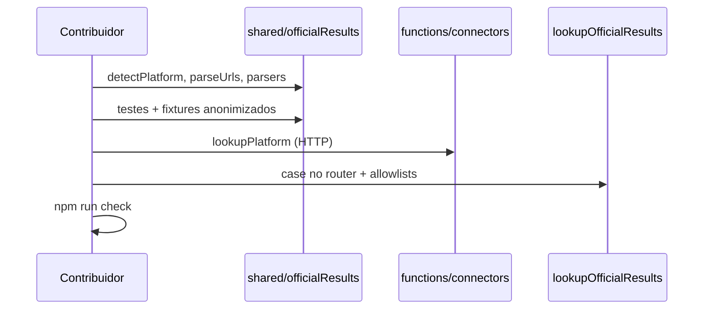

# Como adicionar um conector de resultados

**Português** · [English](#english)

---

<a id="portugues"></a>

## Português

Guia para contribuidores que queiram suportar uma **nova plataforma de timing** (ou melhorar uma existente). Lê primeiro [`architecture.md`](./architecture.md) e [`timing-scraping-disclaimer.md`](./timing-scraping-disclaimer.md).

### O que é um conector

Um conector:

1. Recebe o **perfil de resultados** do utilizador (nome, aliases; ou Parkrunner ID para Parkrun) e um **URL público** do evento.
2. Faz pedidos HTTP a partir da Cloud Function `lookupOfficialResults`.
3. Devolve zero ou mais `OfficialResultCandidate` (tempo, posição, nome encontrado, URL fonte).

O utilizador **confirma** na app antes de gravar — o conector não escreve no Firestore.

### Onde vive o código

| Responsabilidade | Onde | Testável sem rede |
|------------------|------|-------------------|
| Detecção de plataforma, parsing de URLs, parsing de HTML/JSON/CSV | `shared/officialResults/` | Sim (Vitest + fixtures) |
| `fetch`, headers, orquestração HTTP | `functions/src/connectors/` | Integração / emulador |
| Router de plataformas | `functions/src/connectors/index.ts` | — |
| Callable + rate limit | `functions/src/lookupOfficialResults.ts` | `firestore.rules.test.ts` (rate limit) |

No build das Functions, `shared/officialResults` é **copiado** para `functions/src/shared` (ver script `build` em `functions/package.json`). Mantém a lógica pura em `shared/` para a app e os testes usarem o mesmo código.

### Fluxo end-to-end



### Checklist — ficheiros a tocar

Substitui `myplatform` pelo slug em camelCase (ex.: `eqtiming`, `mikatiming`).

#### 1. Tipo e etiqueta UI

[`shared/officialResults/types.ts`](../shared/officialResults/types.ts):

- Adicionar a `ResultsPlatform` (string literal).
- Incluir em `RESULTS_PLATFORMS`.
- Mapear em `resultsPlatformLabel()` (nome visível nas definições e no lookup).

#### 2. Detecção a partir do URL

[`shared/officialResults/detectPlatform.ts`](../shared/officialResults/detectPlatform.ts):

- Regra em `detectPlatformFromUrl()` — hostname, path, query params.
- Se o evento for só por nome (ex. Parkrun), `detectPlatform()` já trata `eventName` à parte.

#### 3. Parsing e URLs (lógica pura)

Criar ou estender módulos em `shared/officialResults/`:

| Ficheiro típico | Conteúdo |
|-----------------|----------|
| `myplatform.ts` | Tipos, `parseMyPlatformUrl`, builders de API, parsers de resposta |
| `myplatformSearch.ts` | `buildMyPlatformSearchTerm(profile)` — opcional, se o termo de pesquisa tiver regras |
| `parseUrls.ts` | Re-export ou `parseMyPlatformUrl` se seguires o padrão centralizado |

Exportar em [`shared/officialResults/index.ts`](../shared/officialResults/index.ts) se criares ficheiros novos.

#### 4. Correspondência de nomes

Usa funções existentes em [`shared/officialResults/matchName.ts`](../shared/officialResults/matchName.ts):

- `namesMatch(profile, first, last)` — campos separados.
- `namesMatchFullName(profile, fullName)` — nome completo numa string.
- `matchesResultsProfile(profile, fullName)` — inclui aliases do perfil.

#### 5. Conector HTTP (servidor)

Criar [`functions/src/connectors/myplatform.ts`](../functions/src/connectors/myplatform.ts):

```ts
export async function lookupMyPlatform(
  resultsUrl: string,
  profile: UserResultsProfile,
): Promise<OfficialResultCandidate[]> {
  // 1. parse URL → 2. build search term → 3. fetch → 4. parse → 5. match name → 6. return candidates
}
```

Registar em [`functions/src/connectors/index.ts`](../functions/src/connectors/index.ts) no `switch` de `lookupPlatform`.

**Boas práticas:**

- Só URLs e dados **públicos**; sem contornar login ou paywalls.
- `User-Agent` e `Referer` razoáveis (ver conectores existentes).
- Devolver `[]` quando não há match (não lançar erro por «não encontrado»).
- Lançar `Error` só para falhas de rede/resposta inesperada (a callable converte em `internal`).
- Normalizar tempos (ver `functions/src/utils/time.ts` ou parsers da plataforma).

#### 6. Allowlists no servidor e cliente

Hoje é preciso actualizar **manualmente** (duplicação conhecida):

| Ficheiro | Motivo |
|----------|--------|
| [`functions/src/lookupOfficialResults.ts`](../functions/src/lookupOfficialResults.ts) | `normalizeResultsPlatform()` — valida `resultsPlatform` guardado no evento |
| [`src/services/events.ts`](../src/services/events.ts) | `docToEvent()` — aceita o valor ao ler Firestore |

Se a detecção precisar de um fetch extra (como SCC Events ou Wiclax), pode ser necessário `resolve…UrlParts()` em `lookupOfficialResults` antes de `lookupPlatform`.

#### 7. Testes

Criar [`shared/officialResults/myplatform.test.ts`](../shared/officialResults/):

- `detectPlatformFromUrl` com URLs reais de exemplo.
- Parsers com fixtures em `shared/officialResults/fixtures/` (**sem PII real** — usar «Zé Ninguém» ou dados públicos redigidos).
- Correspondência de nomes com perfis de teste.

Correr:

```bash
npm run test -- shared/officialResults/myplatform.test.ts
npm run check
```

Testar lookup completo (HTTP real):

```bash
npm run emulators   # terminal 1
npm run dev         # terminal 2 — .env.local com emuladores
```

Cria um evento com URL da plataforma, configura nome no perfil de resultados, usa **Procurar resultado**.

#### 8. Documentação e PR

- Menciona a plataforma no PR (URLs de exemplo, limitações conhecidas).
- Se afectar operadores: nota em [`timing-scraping-disclaimer.md`](./timing-scraping-disclaimer.md) só se mudar política geral (normalmente não é preciso por conector).
- [`change-log.md`](../change-log.md) + [`change-log.en.md`](../change-log.en.md) se for release user-facing (regra do [`CONTRIBUTING.md`](../CONTRIBUTING.md)).

### Referência: EQ Timing

Conector relativamente simples (API JSON + CSV públicos):

| Peça | Ficheiro |
|------|----------|
| URL + hash | `shared/officialResults/eqTiming.ts`, `parseUrls.ts` |
| Termo de pesquisa | `shared/officialResults/eqTimingSearch.ts` |
| Detecção | `detectPlatform.ts` |
| HTTP | `functions/src/connectors/eqTiming.ts` |
| Testes | `shared/officialResults/eqTiming.test.ts` + fixtures |

### Referência: mika:timing

Conector mais complexo (HTML, formulários, domínios custom):

- `shared/officialResults/mikaTiming.ts` — parsing de páginas e tabelas.
- `functions/src/connectors/mikaTiming.ts` — POST de pesquisa e paginação.

Útil quando a plataforma não expõe API JSON estável.

### Caso especial: Parkrun

- Plataforma `parkrun`; lookup por **Parkrunner ID**, não por nome no URL do evento.
- `canLookupPlatform()` em `types.ts` — regra `parkrun` vs outras plataformas.
- Conector: `functions/src/connectors/parkrun.ts`.

### Tipo `OfficialResultCandidate`

Definido em [`shared/officialResults/types.ts`](../shared/officialResults/types.ts):

| Campo | Notas |
|-------|-------|
| `platform` | Slug `ResultsPlatform` |
| `matchedName` | Nome como aparece na fonte |
| `time` | `HH:MM:SS` ou formato já usado na app |
| `position`, `totalParticipants` | Opcionais |
| `sourceUrl` | Página de onde veio o dado |
| `confidence` | `high` \| `medium` \| `low` |

### Limites e ética

- Rate limit por utilizador (10 s) — [`shared/officialResults/lookupRateLimit.ts`](../shared/officialResults/lookupRateLimit.ts).
- `maxInstances` / `concurrency` do lookup — [`cloud-functions-limits.md`](./cloud-functions-limits.md).
- Respeita ToS dos sites — [`timing-scraping-disclaimer.md`](./timing-scraping-disclaimer.md).

### Checklist rápido do PR

- [ ] `types.ts` + `detectPlatform.ts`
- [ ] Módulo(s) em `shared/officialResults/` com testes e fixtures anonimizados
- [ ] `functions/src/connectors/myplatform.ts` + `connectors/index.ts`
- [ ] Allowlists em `lookupOfficialResults.ts` e `events.ts`
- [ ] `npm run check` verde
- [ ] Testado no emulador com URL real (ou documentado por que não foi possível)
- [ ] Changelog se for entrada de versão

---

<a id="english"></a>

## English

[Português](#portugues)

Guide for contributors adding support for a **new timing platform** (or improving an existing one). Read [`architecture.md`](./architecture.md) and [`timing-scraping-disclaimer.md`](./timing-scraping-disclaimer.md) first.

### What a connector is

A connector:

1. Takes the user’s **results profile** (name, aliases; or Parkrunner ID for Parkrun) and a **public** event results URL.
2. Performs HTTP requests from the `lookupOfficialResults` Cloud Function.
3. Returns zero or more `OfficialResultCandidate` objects (time, position, matched name, source URL).

The user **confirms** in the app before saving — the connector does not write to Firestore.

### Where code lives

| Responsibility | Location | Testable offline |
|----------------|----------|------------------|
| Platform detection, URL parsing, HTML/JSON/CSV parsing | `shared/officialResults/` | Yes (Vitest + fixtures) |
| `fetch`, headers, HTTP orchestration | `functions/src/connectors/` | Integration / emulator |
| Platform router | `functions/src/connectors/index.ts` | — |
| Callable + rate limit | `functions/src/lookupOfficialResults.ts` | `firestore.rules.test.ts` (rate limit) |

On Functions build, `shared/officialResults` is **copied** into `functions/src/shared` (see `build` in `functions/package.json`). Keep pure logic in `shared/` so the app and tests share the same code.

### End-to-end flow

Same diagram as Portuguese section above.

### Checklist — files to touch

Replace `myplatform` with your camelCase slug (e.g. `eqtiming`, `mikatiming`).

#### 1. Type and UI label

[`shared/officialResults/types.ts`](../shared/officialResults/types.ts):

- Add to `ResultsPlatform`.
- Include in `RESULTS_PLATFORMS`.
- Map in `resultsPlatformLabel()`.

#### 2. URL detection

[`shared/officialResults/detectPlatform.ts`](../shared/officialResults/detectPlatform.ts):

- Rule in `detectPlatformFromUrl()`.
- Name-only events (e.g. Parkrun) are handled via `eventName` in `detectPlatform()`.

#### 3. Parsing and URLs (pure logic)

Create or extend modules under `shared/officialResults/`:

| Typical file | Contents |
|--------------|----------|
| `myplatform.ts` | Types, `parseMyPlatformUrl`, API URL builders, response parsers |
| `myplatformSearch.ts` | `buildMyPlatformSearchTerm(profile)` — optional |
| `parseUrls.ts` | Centralized `parseMyPlatformUrl` if you follow that pattern |

Export from [`shared/officialResults/index.ts`](../shared/officialResults/index.ts) when adding new modules.

#### 4. Name matching

Use [`shared/officialResults/matchName.ts`](../shared/officialResults/matchName.ts):

- `namesMatch`, `namesMatchFullName`, `matchesResultsProfile`.

#### 5. HTTP connector (server)

Create [`functions/src/connectors/myplatform.ts`](../functions/src/connectors/myplatform.ts) and register it in [`functions/src/connectors/index.ts`](../functions/src/connectors/index.ts).

**Good practices:**

- Public URLs and data only; no bypassing login or paywalls.
- Reasonable `User-Agent` and `Referer` (see existing connectors).
- Return `[]` when no match; throw only on unexpected network/response failures.
- Normalize times consistently.

#### 6. Server and client allowlists

Update manually today:

| File | Why |
|------|-----|
| [`functions/src/lookupOfficialResults.ts`](../functions/src/lookupOfficialResults.ts) | `normalizeResultsPlatform()` |
| [`src/services/events.ts`](../src/services/events.ts) | `docToEvent()` Firestore parsing |

Some platforms need extra resolution in `lookupOfficialResults` (see SCC Events, Wiclax).

#### 7. Tests

Add [`shared/officialResults/myplatform.test.ts`](../shared/officialResults/) with anonymized fixtures under `fixtures/`.

```bash
npm run test -- shared/officialResults/myplatform.test.ts
npm run check
```

Full lookup (real HTTP): Firebase emulators + dev server — create an event, set results profile, use **Search for result**.

#### 8. Docs and PR

- Describe the platform, sample URLs, and known limits in the PR.
- Update [`change-log.md`](../change-log.md) / [`change-log.en.md`](../change-log.en.md) for user-facing releases per [`CONTRIBUTING.md`](../CONTRIBUTING.md).

### Reference: EQ Timing

Simple connector (public JSON API + CSV): see `eqTiming.ts`, `eqTimingSearch.ts`, `functions/src/connectors/eqTiming.ts`, and `eqTiming.test.ts`.

### Reference: mika:timing

Complex connector (HTML forms, custom domains): `mikaTiming.ts` + `functions/src/connectors/mikaTiming.ts`.

### Special case: Parkrun

Uses **Parkrunner ID**, not name on the event URL. See `canLookupPlatform()` and `functions/src/connectors/parkrun.ts`.

### `OfficialResultCandidate` fields

See [`shared/officialResults/types.ts`](../shared/officialResults/types.ts) — `platform`, `matchedName`, `time`, optional `position` / `totalParticipants`, `sourceUrl`, `confidence`.

### Limits and ethics

- Per-user rate limit (10 s).
- Lookup `maxInstances` / `concurrency` — [`cloud-functions-limits.md`](./cloud-functions-limits.md).
- Third-party ToS — [`timing-scraping-disclaimer.md`](./timing-scraping-disclaimer.md).

### Quick PR checklist

- [ ] `types.ts` + `detectPlatform.ts`
- [ ] `shared/officialResults/` module(s) with tests and anonymized fixtures
- [ ] `functions/src/connectors/myplatform.ts` + `connectors/index.ts`
- [ ] Allowlists in `lookupOfficialResults.ts` and `events.ts`
- [ ] `npm run check` green
- [ ] Tested on emulator with a real URL (or documented why not)
- [ ] Changelog if shipping in a release
