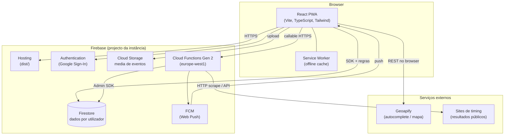
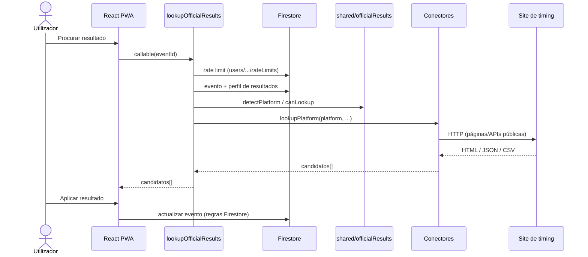
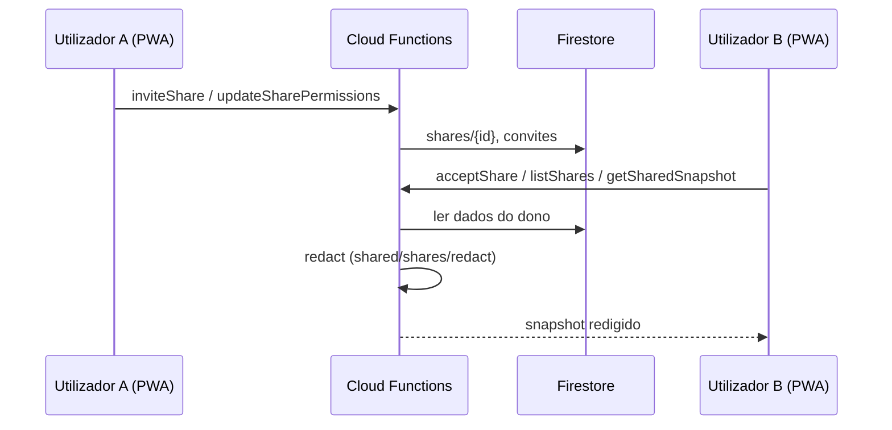
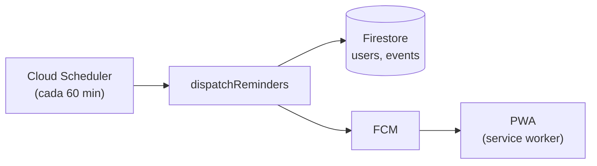
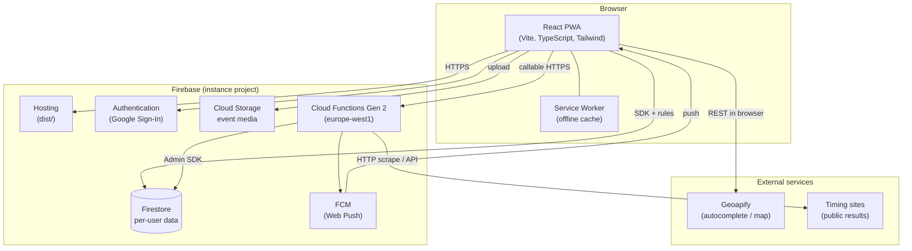
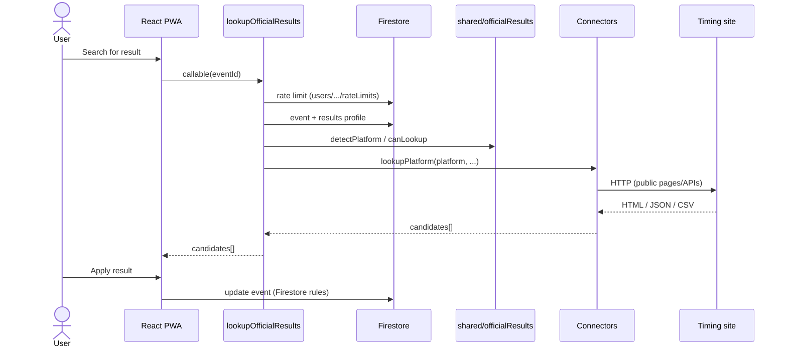
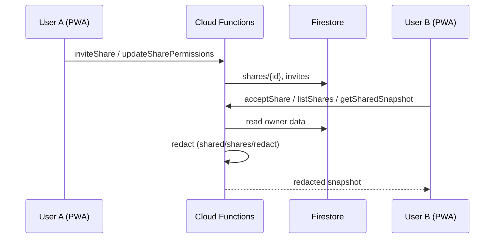

# Arquitectura — Queima Asfalto

**Português** · [English](#english)

---

## Português

Visão geral da arquitectura da PWA, backend Firebase e integrações externas. Para deploy, ver [`self-hosting.md`](./self-hosting.md); para limites das Functions, [`cloud-functions-limits.md`](./cloud-functions-limits.md).

### Diagrama principal

A PWA fala **directamente** com Firestore e Storage (com regras de segurança no cliente). Operações sensíveis ou que exigem privilégios extra passam por **Cloud Functions** (callables autenticadas ou tarefas agendadas).

### Camadas do código

| Camada | Localização | Responsabilidade |
|--------|-------------|------------------|
| UI | `src/pages/`, `src/components/` | Rotas, formulários, dashboards, mapa |
| Estado / hooks | `src/hooks/`, `src/contexts/` | Auth, partilhas, cooldown de lookup |
| Serviços cliente | `src/services/` | Firestore, Storage, callables, Geoapify, export/import |
| Lógica partilhada | `shared/` | Detecção de plataforma, parsing de URLs, permissões de partilha, lembretes — usada pela app **e** pelas Functions |
| Backend | `functions/src/` | Callables, agendador, conectores de timing |
| Regras | `firestore.rules`, `storage.rules` | Isolamento por `userId`, validação de paths |

### Fluxo: importação de resultados oficiais

- **Cliente:** `OfficialResultsLookup` → `src/services/officialResultsLookup.ts`
- **Servidor:** `functions/src/lookupOfficialResults.ts` → `functions/src/connectors/`
- **Parsing / testes:** `shared/officialResults/` (sincronizado para Functions no build)
- **Aviso legal:** [`timing-scraping-disclaimer.md`](./timing-scraping-disclaimer.md)

### Fluxo: partilhas entre utilizadores

Dados partilhados **não** são expostos em bruto no Firestore do convidado: a redacção acontece **no servidor** antes da resposta. Permissões em `shared/shares/permissions.ts`.

### Fluxo: lembretes (notificações)

Lógica de «quem deve receber o quê» em `shared/reminders/`; fila local opcional em `src/services/reminderQueue.ts`.

### Firestore — coleções principais

| Coleção | Dono | Conteúdo típico |
|---------|------|-----------------|
| `users/{uid}` | utilizador | Perfil, Parkrunner ID, prefs de notificação |
| `users/{uid}/rateLimits/{id}` | utilizador | Cooldown de lookup (só servidor escreve) |
| `users/{uid}/reminderDispatches/{id}` | utilizador | Idempotência de lembretes |
| `events/{id}` | `userId` no doc | Eventos, resultados, localização |
| `events/{id}/media/{id}` | mesmo `userId` | Metadados de fotos/vídeos |
| `goals/{id}`, `performanceGoals/{id}` | `userId` | Objectivos |
| `bucketListItems/{id}` | `userId` | Bucket list |
| `shares/{id}` | participantes | Convites e permissões de partilha |

Índices compostos: `firestore.indexes.json`. Testes de regras: `firestore.rules.test.ts`.

### Cloud Functions

| Função | Tipo | Papel |
|--------|------|-------|
| `lookupOfficialResults` | Callable | Importação de resultados via conectores |
| `inviteShare`, `acceptShare`, `declineShare`, `revokeShare`, `updateSharePermissions`, `listShares`, `getSharedSnapshot`, `createSharedBucketListItem`, `updateSharedBucketListItem`, `deleteSharedBucketListItem` | Callable | Partilhas e bucket list partilhada |
| `dispatchReminders` | Agendada | Envio de lembretes FCM |

Todas as callables exigem `request.auth`. Limites de escala: [`functionOptions.ts`](../functions/src/functionOptions.ts).

### Conectores de timing

Router em [`functions/src/connectors/index.ts`](../functions/src/connectors/index.ts). Cada ficheiro implementa HTTP para uma plataforma; a detecção e parsing partilhados vivem em `shared/officialResults/`.

Plataformas actuais (ver `RESULTS_PLATFORMS` em [`shared/officialResults/types.ts`](../shared/officialResults/types.ts)): Parkrun, Sporthive, Davengo, MyRaceResult, SCC Events, MaxFunSports, MyRacePartner, Strassenlauf.org, ZielZeit, EQ Timing, NSF Berlin, RunCzech, Ultimate, VCRunning, Wiclax, Tímataka, mika:timing.

### Serviços externos (fora do Firebase)

| Serviço | Onde corre | Uso |
|---------|------------|-----|
| **Geoapify** | Browser (`src/services/geoapify.ts`) | Autocomplete e geocodificação de locais |
| **Sites de timing** | Cloud Function | Scraping/API de resultados públicos |
| **Google Analytics** | Browser (opcional) | `src/services/analytics.ts` |

### Offline e PWA

- Firestore **persistent cache** (multi-tab) quando IndexedDB está disponível — ver `src/services/firebase.ts`.
- Service worker (Vite PWA) faz precache do shell da app; dados vivem no Firestore local.
- Catálogo Parkrun estático em `src/data/parkrun-events.json` (gerado por `npm run sync:parkrun-events`).

### Desenvolvimento local

Emuladores Firebase (Auth, Firestore, Functions, Storage) — ver [`emulators.md`](./emulators.md). O código em `src/config/emulators.ts` liga a PWA aos ports definidos em `firebase.json`.

### Documentação relacionada

| Tópico | Ficheiro |
|--------|----------|
| Deploy | [`self-hosting.md`](./self-hosting.md) |
| Novos conectores | [`adding-a-results-connector.md`](./adding-a-results-connector.md) |
| Variáveis de ambiente | [`configuration.md`](./configuration.md) |
| Limites CF | [`cloud-functions-limits.md`](./cloud-functions-limits.md) |
| Scraping / ToS | [`timing-scraping-disclaimer.md`](./timing-scraping-disclaimer.md) |
| Segurança | [`SECURITY.md`](../SECURITY.md) |
| Contribuir | [`CONTRIBUTING.md`](../CONTRIBUTING.md) |

---

## English

[Português](#portugues)

High-level view of the PWA, Firebase backend, and external integrations. For deployment, see [`self-hosting.md`](./self-hosting.md); for Function limits, [`cloud-functions-limits.md`](./cloud-functions-limits.md).

### Main diagram

The PWA talks **directly** to Firestore and Storage (with security rules on the client). Sensitive operations or those needing elevated privileges go through **Cloud Functions** (authenticated callables or scheduled jobs).

### Code layers

| Layer | Location | Responsibility |
|-------|----------|----------------|
| UI | `src/pages/`, `src/components/` | Routes, forms, dashboards, map |
| State / hooks | `src/hooks/`, `src/contexts/` | Auth, shares, lookup cooldown |
| Client services | `src/services/` | Firestore, Storage, callables, Geoapify, export/import |
| Shared logic | `shared/` | Platform detection, URL parsing, share permissions, reminders — used by the app **and** Functions |
| Backend | `functions/src/` | Callables, scheduler, timing connectors |
| Rules | `firestore.rules`, `storage.rules` | `userId` isolation, path validation |

### Flow: official results import

- **Client:** `OfficialResultsLookup` → `src/services/officialResultsLookup.ts`
- **Server:** `functions/src/lookupOfficialResults.ts` → `functions/src/connectors/`
- **Parsing / tests:** `shared/officialResults/` (synced into Functions at build)
- **Legal notice:** [`timing-scraping-disclaimer.md`](./timing-scraping-disclaimer.md)

### Flow: sharing between users

Shared data is **not** exposed in plain form in the invitee’s Firestore: redaction runs **on the server** before the response. Permissions in `shared/shares/permissions.ts`.

### Flow: reminders (notifications)

Scheduling logic in `shared/reminders/`; optional local queue in `src/services/reminderQueue.ts`.

### Firestore — main collections

| Collection | Owner | Typical content |
|------------|-------|-----------------|
| `users/{uid}` | user | Profile, Parkrunner ID, notification prefs |
| `users/{uid}/rateLimits/{id}` | user | Lookup cooldown (server writes only) |
| `users/{uid}/reminderDispatches/{id}` | user | Reminder idempotency |
| `events/{id}` | `userId` on doc | Events, results, location |
| `events/{id}/media/{id}` | same `userId` | Photo/video metadata |
| `goals/{id}`, `performanceGoals/{id}` | `userId` | Goals |
| `bucketListItems/{id}` | `userId` | Bucket list |
| `shares/{id}` | participants | Share invites and permissions |

Composite indexes: `firestore.indexes.json`. Rules tests: `firestore.rules.test.ts`.

### Cloud Functions

| Function | Type | Role |
|----------|------|------|
| `lookupOfficialResults` | Callable | Results import via connectors |
| `inviteShare`, `acceptShare`, `declineShare`, `revokeShare`, `updateSharePermissions`, `listShares`, `getSharedSnapshot`, `createSharedBucketListItem`, `updateSharedBucketListItem`, `deleteSharedBucketListItem` | Callable | Sharing and shared bucket list |
| `dispatchReminders` | Scheduled | FCM reminder dispatch |

All callables require `request.auth`. Scaling limits: [`functionOptions.ts`](../functions/src/functionOptions.ts).

### Timing connectors

Router in [`functions/src/connectors/index.ts`](../functions/src/connectors/index.ts). Each file implements HTTP for one platform; shared detection and parsing live in `shared/officialResults/`.

Current platforms (see `RESULTS_PLATFORMS` in [`shared/officialResults/types.ts`](../shared/officialResults/types.ts)): Parkrun, Sporthive, Davengo, MyRaceResult, SCC Events, MaxFunSports, MyRacePartner, Strassenlauf.org, ZielZeit, EQ Timing, NSF Berlin, RunCzech, Ultimate, VCRunning, Wiclax, Tímataka, mika:timing.

### External services (outside Firebase)

| Service | Where it runs | Use |
|---------|---------------|-----|
| **Geoapify** | Browser (`src/services/geoapify.ts`) | Location autocomplete and geocoding |
| **Timing sites** | Cloud Function | Public results scraping/API |
| **Google Analytics** | Browser (optional) | `src/services/analytics.ts` |

### Offline and PWA

- Firestore **persistent cache** (multi-tab) when IndexedDB is available — see `src/services/firebase.ts`.
- Service worker (Vite PWA) precaches the app shell; data lives in local Firestore.
- Static Parkrun catalog in `src/data/parkrun-events.json` (built via `npm run sync:parkrun-events`).

### Local development

Firebase emulators (Auth, Firestore, Functions, Storage) — see [`emulators.md`](./emulators.md). Code in `src/config/emulators.ts` connects the PWA to ports in `firebase.json`.

### Related documentation

| Topic | File |
|-------|------|
| Deploy | [`self-hosting.md`](./self-hosting.md) |
| New connectors | [`adding-a-results-connector.md`](./adding-a-results-connector.md) |
| Environment variables | [`configuration.md`](./configuration.md) |
| CF limits | [`cloud-functions-limits.md`](./cloud-functions-limits.md) |
| Scraping / ToS | [`timing-scraping-disclaimer.md`](./timing-scraping-disclaimer.md) |
| Security | [`SECURITY.md`](../SECURITY.md) |
| Contributing | [`CONTRIBUTING.md`](../CONTRIBUTING.md) |
