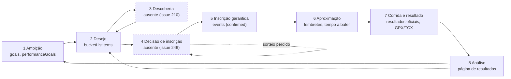
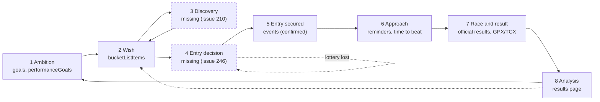

# Ciclo de vida de uma corrida: do desejo à análise

**Português** · [English](#english)

---

## Português

O que um corredor faz, de ponta a ponta, entre a ideia de correr uma prova e a análise do que correu. Serve para situar cada feature e cada issue numa fase concreta, e para tornar visível o que a app ainda não cobre. Para a arquitectura técnica, ver [`architecture.md`](./architecture.md).

Duas issues abertas são metades do mesmo problema: [#210](https://github.com/Seven-Panda-Labs/queima-asfalto/issues/210) (encontrar a prova) e [#246](https://github.com/Seven-Panda-Labs/queima-asfalto/issues/246) (decidir e garantir a inscrição). Este documento é o contexto comum das duas.

### O ciclo

O ciclo fecha: a análise de uma temporada é o que alimenta a ambição e os desejos da seguinte. Hoje esse regresso só acontece na cabeça do corredor.

### Duas velocidades, e o papel de cada prova

Todos os corredores entrevistados até agora planeiam da mesma maneira: têm 1 a 3 provas principais por ano (a favorita, a de sonho, o desafio de distância) e é a marcação dessas que fixa o resto do calendário. As outras espalham-se ao longo do ano como build-up ou testes para as principais.

Todas as provas passam pelas oito fases. O que muda entre uma âncora e uma secundária é a velocidade, o risco e o critério de decisão, porque o que muda é a escassez da inscrição.

| | Prova âncora | Prova secundária |
|---|---|---|
| Horizonte | 6 a 18 meses | dias a semanas |
| Fase 3, descoberta | não é uma pesquisa: a prova aparece («vi a Sydney e apeteceu-me») e é escolhida pelo nome | é uma pesquisa, e o critério vem da âncora: «encaixar um 10 km em Julho como preparação, de preferência sem viajar» |
| Fase 4, decisão | calendário de decisões: quando abre, é sorteio, até quando posso decidir. Falhar a porta custa um ano | três perguntas: está disponível, a data encaixa no plano, há alternativas? Se houver, escolhe-se a mais interessante; se não, aceita-se |
| Custo de errar | uma temporada | trocar por outra prova |

**As provas não são independentes.** A data da âncora é o input para escolher as secundárias: um teste faz-se 4 a 8 semanas antes, não duas. Hoje nada no modelo relaciona duas provas. #246 acrescenta `isAnchor`, o que dá nome à âncora mas não ao papel das restantes nem à relação entre elas, e adia explicitamente o calendário de temporada e os avisos de sobreposição para outra issue.

**Regras de temporada, não plano de treino.** O plano de treino fica fora do produto, e o que falta é bem menos do que isso: um punhado de regras explícitas que a descoberta possa usar para ordenar candidatos e para avisar quando o calendário as quebra. As duas primeiras, das entrevistas: uma prova com cerca de metade da distância da âncora, 3 a 4 semanas antes; nunca mais de 1 a 2 provas por mês. A lista é curada e cresce com o tempo, logo o sítio dela é um módulo puro e testado, ao lado do funil que #246 propõe, e não uma condição escondida dentro de um componente.

**Para #210:** o formulário de critérios (disciplina, área e raio, intervalo de meses) é a consulta de uma prova de build-up, não de uma de sonho: uma âncora chega de fora da app, com nome. O que falta aos critérios é o que os liga à âncora, porque a janela de datas deriva da data dela, e «sem viajar» é o caso normal e não uma opção entre outras.

**Para #246:** o funil não pode obrigar uma inscrição de risco baixo à mesma cerimónia. E o que decide a cerimónia não é a distância nem o papel da prova, é a escassez da inscrição: um 10 km com sorteio é um problema de âncora, uma maratona com inscrição aberta até à véspera não é.

**E a fase 8 tem aqui trabalho a fazer.** Uma prova de build-up é, por definição, informação sobre a âncora. O `RacePredictor` já calcula esse número (equivalência a partir da forma recente), só não sabe para que prova devia estar a apontar.

### As oito fases

| # | Fase | O que o corredor quer | O que a app faz hoje | Onde no código |
|---|------|-----------------------|----------------------|----------------|
| 1 | **Ambição** | «Quais são as 1 a 3 provas que definem o ano, e a que ritmo» | Objectivos de contagem por disciplina e ano, e objectivos de desempenho (PB, ritmo, tempo). Nada nomeia uma prova principal | [`src/pages/Goals/`](../src/pages/Goals/), [`Goal.ts`](../src/types/Goal.ts), [`PerformanceGoal.ts`](../src/types/PerformanceGoal.ts) |
| 2 | **Desejo** | «Vi a Sydney, quero fazer aquilo» | Bucket list: nome, local, distância, disciplinas, mês alvo, link, notas. Lista e mapa | [`src/pages/BucketList/`](../src/pages/BucketList/), [`BucketListItem.ts`](../src/types/BucketListItem.ts) |
| 3 | **Descoberta** | «Que opções tenho para uma maratona de outono de 2027», e «encaixar um 10 km em Julho sem viajar» | Nada. A entrada é manual, ou import de Excel | ausente, #210 |
| 4 | **Decisão de inscrição** | «Quando abre, é sorteio, quanto custa, até quando posso decidir» | Nada. Nenhuma data que não seja a data da prova existe no modelo | ausente, #246 |
| 5 | **Inscrição garantida** | «Está paga, está no calendário» | Evento com estado `confirmed`. Agendar a partir da bucket list copia os campos e oferece apagar o item | [`EventForm.tsx`](../src/pages/Events/EventForm.tsx), [`ScheduleDisciplineDialog`](../src/components/ScheduleDisciplineDialog/) |
| 6 | **Aproximação** | «Falta quanto, e o que tenho a bater» | Um lembrete FCM (1, 2, 3 ou 7 dias antes, a uma hora fixa), contagem no cartão de casa, tempo a bater quando o percurso já foi corrido | [`shared/reminders/`](../shared/reminders/), [`NextEventCard`](../src/components/NextEventCard/), [`analytics/course.ts`](../src/utils/analytics/course.ts) |
| 7 | **Corrida e resultado** | «Correr, e registar o que aconteceu» | Transição automática para `missed`, tempo e ritmo à mão, importação oficial em 17 plataformas, ficheiro GPX/TCX com splits e traçado, fotos e vídeos | [`useAutoTransitions.ts`](../src/hooks/useAutoTransitions.ts), [`functions/src/connectors/`](../functions/src/connectors/), [`src/domain/activityTrack/`](../src/domain/activityTrack/) |
| 8 | **Análise** | «O que é que isto quer dizer» | Temporadas, recordes e progressão, percentil, curva de forma, sazonalidade, pacing, mapa de calor, totais de carreira, previsão por equivalência, histórico de percurso, conquistas | [`src/pages/Results/`](../src/pages/Results/), [`src/components/Analysis/`](../src/components/Analysis/), [`src/utils/analytics/`](../src/utils/analytics/) |

A app é forte nas duas pontas e vazia no meio. As fases 7 e 8 são das partes mais trabalhadas do produto; as fases 3 e 4, que é onde a decisão acontece, não existem.

E o incumbente dessas duas fases é uma folha de cálculo. O repo já teve de lhe fazer ponte: o import de Excel existiu por isso, e é por causa dele que `targetMonth` guarda nomes de meses em inglês. Essa ponte vai ser retirada, porque o backup em zip cobre o mesmo com muito mais precisão, mas o incumbente não muda: quem planeia a temporada continua a planeá-la numa folha, fora da app. O que a descoberta e a decisão têm de bater não é outra app, é o Excel.

A retirada tem duas consequências para este ciclo. A capacidade de entrada em massa na bucket list desaparece, logo cada prova passa a entrar uma a uma à mão, o que sobe a fasquia do que a fase 3 tem de entregar: adicionar num clique deixa de ser conveniência. E `targetMonth` perde a razão de ser um nome de mês, que é exactamente a compatibilidade com o Excel que #246 invoca para o manter como está.

### Quando falha

O ciclo acima é o caminho normal. As falhas acontecem por dentro (lesão, desistência a meio, forma que não apareceu) e por fora (prova cancelada, sorteio perdido, viagem que caiu), e a regra de produto é simples: uma falha degrada uma prova, não a temporada, e há sempre a opção de tentar na época seguinte.

O modelo de hoje não serve nenhuma das duas metades da regra:

- **`missed` é automático e sem motivo.** `shouldMarkAsFaltou` marca qualquer prova planeada ou confirmada, sem tempo, com mais de 2 dias de atraso. O mesmo estado cobre «não fui», «lesionei-me», «desisti ao km 30» e «corri e esqueci-me de escrever o tempo».
- **Um DNF não tem representação.** Uma prova concluída sem tempo nem ritmo é descartada por `toAnalysableResults`, logo desaparece de tudo o que a página de resultados mostra, totais de carreira incluídos. Uma prova começada e não acabada não conta nem como começada.
- **A falha não sobe à temporada.** Se a âncora cai, as provas de build-up ficam sem destino e nada o nota. O rollover de #246 existe, mas está pensado para a inscrição que falhou, não para a prova que falhou.

### As quatro costuras

As lacunas mais caras não são fases inteiras que faltam, são as passagens entre fases, onde a informação é copiada ou perdida.

**1. Não existe identidade de corrida.** A mesma prova existe três vezes e nenhuma delas é um identificador: um item de bucket list escrito à mão, um evento por ano escrito à mão, e uma chave derivada do nome (`courseKey`) que o histórico de percurso usa para os agrupar. A consequência é que o agrupamento depende de como o nome foi escrito naquele ano (assumido e documentado em [`analytics/course.ts`](../src/utils/analytics/course.ts): a regra é deliberadamente não difusa), que não há como rolar uma prova anual para o ano seguinte, e que um catálogo curado não tem onde se agarrar. O `catalogRaceId` proposto em #246 seria a primeira identidade real do modelo.

**2. Do desejo ao evento é uma cópia, não uma ligação.** Agendar a partir da bucket list passa os campos por `location.state` e no fim pergunta se o item deve ser apagado (`handleRemoveFromBucketList`). O evento criado não guarda nenhuma referência ao item. O caminho inverso existe só para provas `cancelled` ou `missed` ([`eventToBucketList.ts`](../src/utils/eventToBucketList.ts)) e também copia. Ou seja, a história do desejo (porque o queria, quantos anos tentei) morre no momento em que se torna real. O item tem de sobreviver ao agendamento, porque é dele que pende o rollover anual; o que hoje justifica apagá-lo é não ver a mesma prova em duas listas, e isso é um problema de apresentação, não de modelo.

**3. O horizonte temporal é curto em todos os campos que o exprimem.** `targetMonth` é um mês sem ano, logo não há horizonte plurianual, e sem o import de Excel nada obriga o campo a continuar a ser um nome de mês. `reminderDaysBefore` vai no máximo a 7 dias, com um lembrete único. `Goal` e `PerformanceGoal` têm `year`, mas nenhum campo que ligue um objectivo a uma prova. Quem planeia a 18 meses, que é o caso de quem corre maratonas por sorteio, não tem onde escrever a data que importa.

**4. A análise não regressa ao planeamento.** `RacePredictor` calcula equivalências a partir da forma actual, e o número fica na página de resultados. Nada o transporta para «então o objectivo no Porto em Março é sub 3:30». A excepção é o tempo a bater ([#241](https://github.com/Seven-Panda-Labs/queima-asfalto/issues/241), [#243](https://github.com/Seven-Panda-Labs/queima-asfalto/issues/243)): o histórico do percurso passou a aparecer antes da prova, não só depois. É o único caso em que uma fase alimenta outra, e é o padrão a copiar.

### Restrição transversal: vocabulário de distâncias

`EventType` tem quatro valores (5K, 10K, meia, maratona). Isso limita as duas pontas do ciclo: uma prova descoberta de 17 km não tem onde ser arquivada, e `normalizeEventType('Outra')` já achata tudo o que não encaixa em 10 km, o que envenena ritmos, recordes e previsões a jusante. Qualquer trabalho em descoberta herda este problema no momento em que lê um catálogo real. Ver [#223](https://github.com/Seven-Panda-Labs/queima-asfalto/issues/223).

### Decisões já tomadas

Estão nas issues ou nas entrevistas, e não devem ser reabertas ao passar por aqui:

| Tema | Decisão | Onde |
|------|---------|------|
| Plano de treino | Fora. A app conhece regras de temporada, não sessões | entrevistas |
| Import/export de Excel | Retirado. O backup em zip cobre o mesmo com mais precisão | este documento |
| Âncora com sorteio | A temporada organiza-se depois do sorteio. O ciclo mantém-se, o que é lento é a fase 4 | entrevistas |
| Falha numa prova | Degrada essa prova, não a temporada, e há sempre a opção da época seguinte | entrevistas |
| Identidade da corrida | O `catalogRaceId` de #246 e o catálogo de #210 são a mesma entidade | este documento |
| Item da bucket list | Sobrevive ao agendamento | este documento |
| Agrupamento de percurso | Quando existir identidade, prefere-se ela, com o nome como fallback | este documento |
| Cadência de notificações | 60 minutos, o orçamento que os prazos de inscrição já assumem | #246 |
| Descoberta ao vivo por consulta | Rejeitada. Colheita agendada para um catálogo, pesquisa no cliente | #210 |
| Um conector por site de calendário | Não. Só fontes de tier 1 ou 2 (JSON-LD), ou que preencham uma lacuna | #210 |
| Inscrição automática, pagamentos | Não. Deep link mais checklist | #246 |
| Elegibilidade (projectar PBs contra tempos de qualificação) | Fora de roteiro | #246 |
| Armazenamento da inscrição | Colecção `raceEntries` própria, não embutida no item | #246 |
| Navegação | A bucket list cresce, sem rota nova de planeamento | #246 |
| Integrações Strava/Garmin | Fora da v1. O parser de GPX/TCX serve qualquer integração futura | #226 |
| Um traçado não é verificação | `resultsVerified` continua a vir só da importação oficial | #226 |

### Perguntas abertas

Por ordem de quanto bloqueiam trabalho a jusante:

1. **Como se representa o papel de uma prova na temporada?** `isAnchor` nomeia a âncora, mas falta o papel das restantes e a relação com a âncora a que servem. Campo no item, campo na inscrição, ou derivado das datas? É pré-requisito das regras de temporada e da janela de datas de uma pesquisa de build-up.
2. **«Build-up» e «teste» são a mesma coisa?** Se um corredor distingue a prova que corre a ritmo de objectivo daquela que corre por volume, a fase 8 tem de as ler de forma diferente: a primeira é evidência sobre a âncora, a segunda não é. Vocabulário a fechar antes de existir um campo.
3. **Qual é a lista mínima de motivos de falha?** Não um vocabulário completo, só os motivos a que algo reage: o que propõe a época seguinte, o que sai da análise, e o que continua a contar como prova começada.
4. **A unidade de planeamento é o ano civil ou a temporada?** `Goal.year` e `PerformanceGoal.year` são anos civis, mas o bloco de uma maratona de Março começa no ano anterior. Enquanto os objectivos forem por ano civil, não conseguem descrever um ciclo em torno de uma âncora.
5. **Três candidaturas para um lugar.** Se a temporada se organiza depois do sorteio, o corredor passa meses com âncoras alternativas em aberto. #246 modela cada inscrição isoladamente, e nada diz que aquelas três concorrem ao mesmo lugar no calendário.
6. **Um objectivo pode apontar para uma prova?** É o que fecharia a costura 4. A primeira versão barata é mais concreta: na página da âncora, o que a última prova de build-up prevê para ela.
7. **Quem mantém as regras de temporada, e são visíveis?** Se crescem com o tempo, ou são heurísticas invisíveis que apenas ordenam candidatos, ou são regras que o corredor vê e ajusta. As duas respostas dão produtos diferentes.
8. **A fase 7 tem alguma lacuna real?** Hora de partida, dorsal, onda e logística de viagem não existem, e também não foram pedidos. Confirmar com utilizadores antes de desenhar.
9. **Onde entra a competição entre utilizadores?** [#152](https://github.com/Seven-Panda-Labs/queima-asfalto/issues/152) toca a fase 1 (desafios combinados) e a fase 8 (troféus, streaks). São features diferentes conforme a fase, e a issue trata-as como uma.

### Fora de âmbito

Não faz parte deste ciclo, por decisão e não por esquecimento: planos de treino e o treino diário (a app é sobre provas, não sobre sessões, e as regras de temporada acima são o limite do que sabe sobre treino), inscrição e pagamento dentro da app, comparação de preços, e qualquer fonte atrás de autenticação, paywall, `robots.txt` ou desafio anti-bot.

---

## English

[Português](#portugues)

What a runner does, end to end, between the idea of running a race and the analysis of how it went. It exists to place each feature and each issue in a concrete stage, and to make visible what the app does not cover yet. For the technical architecture, see [`architecture.md`](./architecture.md).

Two open issues are halves of the same problem: [#210](https://github.com/Seven-Panda-Labs/queima-asfalto/issues/210) (finding the race) and [#246](https://github.com/Seven-Panda-Labs/queima-asfalto/issues/246) (deciding and securing the entry). This document is the shared context of both.

### The loop

The loop closes: analysing one season is what feeds the ambition and the wishes of the next. Today that return trip happens only in the runner's head.

### Two speeds, and the role of each race

Every runner interviewed so far plans the same way: they have 1 to 3 main races a year (the favourite, the dream one, the distance challenge), and booking those is what fixes the rest of the calendar. The others get spread across the year as build-up or as tests for the main ones.

Every race goes through all eight stages. What changes between an anchor and a secondary race is the speed, the risk and the decision criteria, because what changes is how scarce the entry is.

| | Anchor race | Secondary race |
|---|---|---|
| Horizon | 6 to 18 months | days to weeks |
| Stage 3, discovery | not a search: the race turns up ("I saw Sydney and fancied it") and is chosen by name | a search, and the criteria come from the anchor: "fit a 10K into July as build-up, preferably without travelling" |
| Stage 4, decision | a decision calendar: when does it open, is it a lottery, how long can I wait. Missing the gate costs a year | three questions: is it available, does the date fit the plan, are there alternatives? If there are, pick the most interesting one; if not, accept it |
| Cost of getting it wrong | a season | swap it for another race |

**Races are not independent.** The anchor's date is the input for choosing the secondary ones: a tune-up goes 4 to 8 weeks before, not two. Today nothing in the model relates one race to another. #246 adds `isAnchor`, which names the anchor but not the role of the others nor any relation between them, and explicitly defers the season timeline and clash warnings to a separate issue.

**Season rules, not a training plan.** Training plans stay out of the product, and what is missing is far less than that: a handful of explicit rules that discovery can use to rank candidates and to warn when the calendar breaks them. The first two, from the interviews: a race at about half the anchor's distance, 3 to 4 weeks before; never more than 1 to 2 races a month. The list is curated and grows over time, so it belongs in a pure, tested module next to the funnel #246 proposes, not in a condition buried inside a component.

**For #210:** the criteria form (discipline, area and radius, month range) is the query for a build-up race, not for a dream one: an anchor arrives from outside the app, by name. What the criteria are missing is what ties them to the anchor, because the date window derives from the anchor's date, and "without travelling" is the normal case rather than one option among others.

**For #246:** the funnel must not put a low-risk entry through the same ceremony. And what decides the ceremony is neither the distance nor the race's role, it is how scarce the entry is: a 10K with a lottery is an anchor-shaped problem, a marathon selling entries until the day before is not.

**And stage 8 has work to do here.** A build-up race is, by definition, information about the anchor. `RacePredictor` already computes that number (equivalence from recent form), it just does not know which race it should be pointing at.

### The eight stages

| # | Stage | What the runner wants | What the app does today | Where in the code |
|---|-------|-----------------------|-------------------------|-------------------|
| 1 | **Ambition** | "Which 1 to 3 races define the year, and at what pace" | Count goals per discipline and year, plus performance goals (PB, pace, time). Nothing names a main race | [`src/pages/Goals/`](../src/pages/Goals/), [`Goal.ts`](../src/types/Goal.ts), [`PerformanceGoal.ts`](../src/types/PerformanceGoal.ts) |
| 2 | **Wish** | "I saw Sydney, I want to do that" | Bucket list: name, location, distance, disciplines, target month, link, notes. List and map | [`src/pages/BucketList/`](../src/pages/BucketList/), [`BucketListItem.ts`](../src/types/BucketListItem.ts) |
| 3 | **Discovery** | "What are my options for a fall 2027 marathon", and "fit a 10K into July without travelling" | Nothing. Entry is manual, or an Excel import | missing, #210 |
| 4 | **Entry decision** | "When does it open, is it a lottery, what does it cost, how long can I wait" | Nothing. No date other than the race date exists in the model | missing, #246 |
| 5 | **Entry secured** | "It is paid, it is on the calendar" | Event with status `confirmed`. Scheduling from the bucket list copies the fields and offers to delete the item | [`EventForm.tsx`](../src/pages/Events/EventForm.tsx), [`ScheduleDisciplineDialog`](../src/components/ScheduleDisciplineDialog/) |
| 6 | **Approach** | "How long to go, and what do I have to beat" | One FCM reminder (1, 2, 3 or 7 days before, at a fixed hour), a countdown on the home card, a time to beat when the course has been run before | [`shared/reminders/`](../shared/reminders/), [`NextEventCard`](../src/components/NextEventCard/), [`analytics/course.ts`](../src/utils/analytics/course.ts) |
| 7 | **Race and result** | "Run it, and record what happened" | Automatic transition to `missed`, time and pace by hand, official results import across 17 platforms, GPX/TCX file with splits and route, photos and videos | [`useAutoTransitions.ts`](../src/hooks/useAutoTransitions.ts), [`functions/src/connectors/`](../functions/src/connectors/), [`src/domain/activityTrack/`](../src/domain/activityTrack/) |
| 8 | **Analysis** | "What does this mean" | Seasons, records and progression, percentile, form curve, seasonality, pacing, heatmap, career totals, equivalence predictions, course history, achievements | [`src/pages/Results/`](../src/pages/Results/), [`src/components/Analysis/`](../src/components/Analysis/), [`src/utils/analytics/`](../src/utils/analytics/) |

The app is strong at both ends and empty in the middle. Stages 7 and 8 are among the most worked parts of the product; stages 3 and 4, which is where the decision happens, do not exist.

And the incumbent for those two stages is a spreadsheet. The repo already had to bridge to it: that is why the Excel import existed, and why `targetMonth` stores English month names. That bridge is being retired, because the zip backup covers the same ground far more precisely, but the incumbent does not change: whoever plans a season still plans it in a spreadsheet, outside the app. What discovery and decision have to beat is not another app, it is Excel.

The retirement has two consequences for this loop. Bulk entry into the bucket list disappears, so every race now goes in one at a time by hand, which raises the bar for what stage 3 has to deliver: adding in one click stops being a convenience. And `targetMonth` loses its reason to be a month name, which is exactly the Excel compatibility #246 invokes for keeping it as it is.

### When it fails

The loop above is the normal path. Failures come from the inside (injury, dropping out mid-race, form that never showed up) and from the outside (race cancelled, lottery lost, travel that fell through), and the product rule is simple: a failure degrades one race, not the season, and there is always the option of trying again next season.

Today's model serves neither half of that rule:

- **`missed` is automatic and carries no reason.** `shouldMarkAsFaltou` marks any planned or confirmed race with no time once it is more than 2 days late. One state covers "I did not go", "I got injured", "I dropped out at km 30" and "I ran it and forgot to type the time".
- **A DNF has no representation.** A completed race with neither time nor pace is dropped by `toAnalysableResults`, so it disappears from everything the results page shows, career totals included. A race started and not finished does not even count as started.
- **The failure does not reach the season.** If the anchor falls, the build-up races are left with nothing to serve and nothing notices. #246's rollover exists, but it is designed for the entry that failed, not for the race that failed.

### The four seams

The expensive gaps are not whole missing stages, they are the handoffs between stages, where information is copied or lost.

**1. There is no race identity.** The same race exists three times and none of them is an identifier: a hand-typed bucket list item, a hand-typed event per year, and a key derived from the name (`courseKey`) that course history uses to group them. The consequences are that grouping depends on how the name was typed that year (assumed and documented in [`analytics/course.ts`](../src/utils/analytics/course.ts): the rule is deliberately not fuzzy), that there is no way to roll an annual race over to the next year, and that a curated catalog has nothing to attach to. The `catalogRaceId` proposed in #246 would be the model's first real identity.

**2. Wish to event is a copy, not a link.** Scheduling from the bucket list passes the fields through `location.state` and then asks whether the item should be deleted (`handleRemoveFromBucketList`). The created event stores no reference to the item. The reverse path exists only for `cancelled` or `missed` races ([`eventToBucketList.ts`](../src/utils/eventToBucketList.ts)) and also copies. So the history of the wish (why I wanted it, how many years I tried) dies the moment it becomes real. The item has to survive scheduling, because the annual rollover hangs off it; what justifies deleting it today is not seeing the same race in two lists, and that is a presentation problem, not a model one.

**3. The planning horizon is short in every field that expresses it.** `targetMonth` is a month with no year, so there is no multi-year horizon, and without the Excel import nothing forces the field to stay a month name. `reminderDaysBefore` stops at 7 days, with a single reminder. `Goal` and `PerformanceGoal` carry a `year`, but no field links a goal to a race. Someone planning 18 months out, which is what running lottery marathons means, has nowhere to write the date that matters.

**4. Analysis does not return to planning.** `RacePredictor` computes equivalences from current form, and the number stays on the results page. Nothing carries it into "so the target in Porto in March is sub 3:30". The exception is the time to beat ([#241](https://github.com/Seven-Panda-Labs/queima-asfalto/issues/241), [#243](https://github.com/Seven-Panda-Labs/queima-asfalto/issues/243)): course history started appearing before the race, not only after it. It is the one case where a stage feeds another, and the pattern to copy.

### Cross-cutting constraint: the distance vocabulary

`EventType` has four values (5K, 10K, half, marathon). That limits both ends of the loop: a discovered 17 km race has nowhere to be filed, and `normalizeEventType('Outra')` already flattens everything that does not fit into the 10K, which poisons paces, records and predictions downstream. Any work on discovery inherits this the moment it reads a real catalog. See [#223](https://github.com/Seven-Panda-Labs/queima-asfalto/issues/223).

### Decisions already taken

They live in the issues or in the interviews, and should not be reopened in passing:

| Topic | Decision | Where |
|-------|----------|-------|
| Training plans | Out. The app knows season rules, not sessions | interviews |
| Excel import/export | Retired. The zip backup covers the same ground more precisely | this document |
| Anchor with a lottery | The season is organised after the draw. The loop stays as it is, what is slow is stage 4 | interviews |
| A failed race | Degrades that race, not the season, and there is always the next season | interviews |
| Race identity | #246's `catalogRaceId` and #210's catalog are the same entity | this document |
| The bucket list item | Survives scheduling | this document |
| Course grouping | Once identity exists, it wins, with the name as fallback | this document |
| Notification cadence | 60 minutes, the budget registration deadlines already assume | #246 |
| Live discovery per query | Rejected. Scheduled harvest into a catalog, client-side search | #210 |
| One connector per calendar site | No. Only tier 1 or 2 sources (JSON-LD), or ones filling a coverage gap | #210 |
| Automatic registration, payments | No. Deep link plus checklist | #246 |
| Eligibility (projecting PBs against qualifying times) | Out of roadmap | #246 |
| Entry storage | Its own `raceEntries` collection, not embedded in the item | #246 |
| Navigation | The bucket list grows, no new planning route | #246 |
| Strava/Garmin integrations | Out of v1. The GPX/TCX parser serves any future integration | #226 |
| A track is not a verification | `resultsVerified` still comes only from the official lookup | #226 |

### Open questions

Ordered by how much downstream work they block:

1. **How is a race's role in the season represented?** `isAnchor` names the anchor, but the role of the others and the relation to the anchor they serve are missing. A field on the item, a field on the entry, or derived from the dates? It is a prerequisite for the season rules and for the date window of a build-up search.
2. **Are "build-up" and "test" the same thing?** If a runner distinguishes the race run at goal pace from the one run for volume, stage 8 has to read them differently: the first is evidence about the anchor, the second is not. Settle the vocabulary before there is a field.
3. **What is the minimum list of failure reasons?** Not a complete vocabulary, only the reasons something reacts to: what offers next season, what leaves the analysis, and what still counts as a race started.
4. **Is the planning unit the calendar year or the season?** `Goal.year` and `PerformanceGoal.year` are calendar years, but the block for a March marathon starts in the previous one. While goals are per calendar year, they cannot describe a cycle around an anchor.
5. **Three applications for one slot.** If the season is organised after the draw, the runner spends months with alternative anchors unresolved. #246 models each entry in isolation, and nothing says those three compete for the same slot in the calendar.
6. **Can a goal point at a race?** That is what would close seam 4. The cheap first version is more concrete: on the anchor's page, what the latest build-up race predicts for it.
7. **Who maintains the season rules, and are they visible?** If they grow over time, they are either invisible heuristics that only rank candidates, or rules the runner sees and adjusts. Those two answers are different products.
8. **Does stage 7 have a real gap?** Start time, bib number, wave and travel logistics do not exist, and have not been asked for either. Confirm with users before designing.
9. **Where does competition between users fit?** [#152](https://github.com/Seven-Panda-Labs/queima-asfalto/issues/152) touches stage 1 (agreed challenges) and stage 8 (trophies, streaks). Those are different features depending on the stage, and the issue treats them as one.

### Out of scope

Not part of this loop, by decision rather than by omission: training plans and daily training (the app is about races, not sessions, and the season rules above are the limit of what it knows about training), registration and payment inside the app, price comparison, and any source behind authentication, a paywall, `robots.txt` or a bot challenge.
